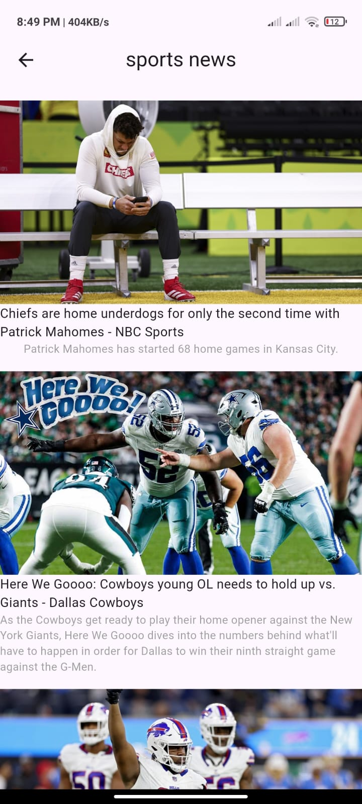

# News App 📰

## 📌 Overview
A modern **News Application** built with **Flutter**, providing users with the latest updates across multiple categories.  
It fetches live data using a **News API** (integrated with **Dio**) and presents it with a clean, responsive UI for a smooth reading experience.

## 🛠️ Technologies & Tools
- **Flutter & Dart**
- **Dio** (API integration & error handling)
- **Cubit** (State Management)
- **OOP Principles & Clean Architecture**

## 🚀 Features
- 📰 Browse top headlines from different categories
- 📂 Categories available: **General, Business, Entertainment, Health, Science, Sports, Technology**
- 📱 Responsive layout that adapts to all screen sizes
- ⚡ Real-time news fetching with **Dio**
- 🛠️ State management handled by Cubit for clean separation of logic

## 📱 Screens
- **Home Screen** → Displays *General* news by default
- **Categories Bar** → Horizontal list to switch between news categories
- **Articles Screen** → View detailed news for each selected category

## 🖼️ Screenshots

| Home (General)                                  | Business News                                     | Entertainment News                                          |  
|-------------------------------------------------|---------------------------------------------------|-------------------------------------------------------------|
|  |  |  |  

| Health News                                   | Science News                                    | Sports News                                   | Technology News                                       |  
|-----------------------------------------------|-------------------------------------------------|-----------------------------------------------|-------------------------------------------------------|  
|  |  |  |  |  

## 📂 Project Structure
- `lib/cubits/` → Business logic with Cubit
- `lib/models/` → News Article model
- `lib/screens/` → Home, Categories, News Details
- `lib/services/` → **Dio API client** for fetching data
- `lib/theme/` → App styling and theming

## 🚧 Future Improvements
- 🔍 **Search functionality** → search for articles by keyword
- ⭐ **Favorites/Bookmark** → save articles for offline reading
- 🌙 **Theme Switcher** → light/dark mode support
- 🌍 **Multi-language support** → expand app to global users
- 🔔 **Notifications** → get alerts for breaking news
- 📌 **Infinite scroll & pagination** → load more articles seamlessly

## ▶️ Demo
[Download APK](https://drive.google.com/file/d/1etilXQ7GGznfSC2_xq44i8wvh1Duo5ql/view?usp=drivesdk)

## 👨‍💻 Author
Mohamed Abdalla Moussa Ibrahim  
[GitHub](https://github.com/mohamed-abdallah-mouse/News_app) | [LinkedIn](https://www.linkedin.com/in/mohamed-abdullah-mouse-69419a1b8)  
